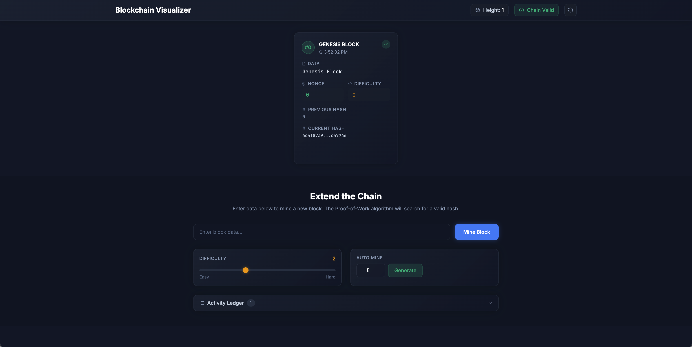
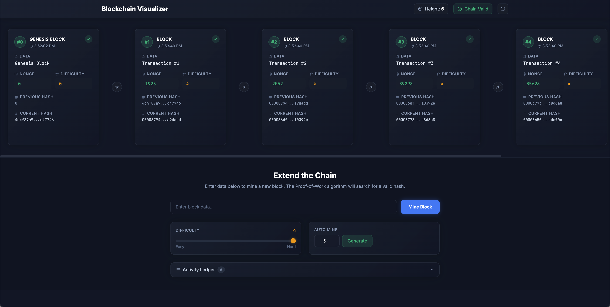

# Blockchain Visualizer

A web application that visualizes how blockchain technology works in real-time. Users can see blocks, mine new blocks, and watch validation happen live.

## Overview

This interactive blockchain visualizer demonstrates core blockchain concepts:

- **Hash Linking:** How blocks link together through cryptographic hashes
- **Mining:** How proof-of-work consensus works
- **Tampering:** How changing data breaks the chain
- **Validation:** How the system detects and displays invalid chains

## Features

- **Visual Block Display:** See all blocks in the chain with complete details (index, timestamp, data, hashes, nonce)
- **Interactive Mining:** Add new blocks by mining with adjustable difficulty
- **Real-time Validation:** Live validation indicator showing chain integrity
- **Difficulty Selector:** Choose between difficulty levels 1-4
- **Tampering Demo:** Edit existing blocks to see how it affects chain validity
- **Auto-Mine:** Automatically mine multiple blocks with progress tracking
- **Transaction Ledger:** View all blockchain data in a simple list format

## Tech Stack

- **React 19** - UI framework
- **Vite** - Build tool and dev server
- **TailwindCSS 4** - Styling
- **crypto-js** - SHA-256 hashing
- **lucide-react** - Icons

## Running Locally

### Option 1: Using Vite Dev Server (Recommended)

1. Install dependencies:

```bash
npm install
```

2. Start the development server:

```bash
npm run dev
```

3. Open your browser to the URL shown in the terminal (typically `http://localhost:5173`)

### Option 2: Open HTML Directly

For a quick preview without installing dependencies:

1. Build the project first:

```bash
npm install
npm run build
```

2. Open `dist/index.html` in your browser

Note: The direct HTML approach requires building first. For development, use the Vite dev server.

## Available Scripts

- `npm run dev` - Start development server
- `npm run build` - Build for production
- `npm run preview` - Preview production build
- `npm run test` - Run tests
- `npm run lint` - Lint source code

## How to Use

1. **Mine a Block:** Enter transaction data and click "Mine Block"
2. **Adjust Difficulty:** Use the difficulty selector to change mining complexity
3. **Edit Blocks:** Click the edit button on any block to tamper with its data
4. **Auto-Mine:** Use the auto-mine feature to add multiple blocks at once
5. **View Ledger:** Check the transaction ledger for a complete list of all data

## Project Structure

```
blockchain-visualizer/
├── src/
│   ├── components/      # React components
│   │   ├── App.jsx
│   │   ├── BlockCard.jsx
│   │   ├── BlockchainView.jsx
│   │   ├── MiningForm.jsx
│   │   └── ...
│   ├── main.jsx         # Application entry point
│   └── index.css        # Global styles
├── public/              # Static assets
├── index.html           # HTML template
└── package.json         # Dependencies and scripts
```

## Screenshots




## Link to Live Demo

[https://blockchain-visualizer-pi.vercel.app](https://blockchain-visualizer-pi.vercel.app)

## License

ISC

## Repository

[https://github.com/mrenzotan/blockchain-visualizer](https://github.com/mrenzotan/blockchain-visualizer)
